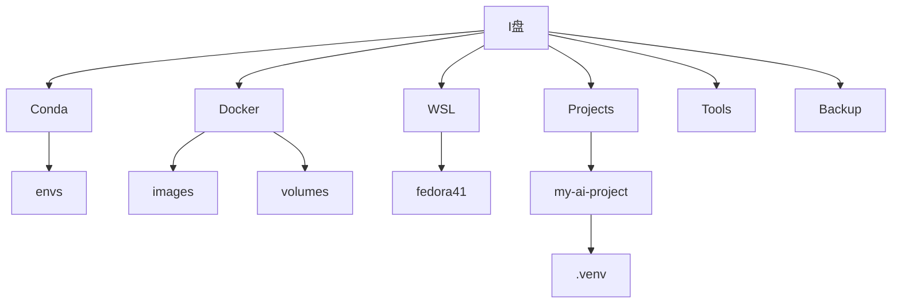
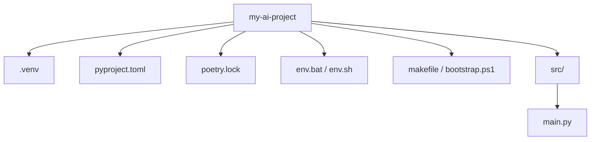
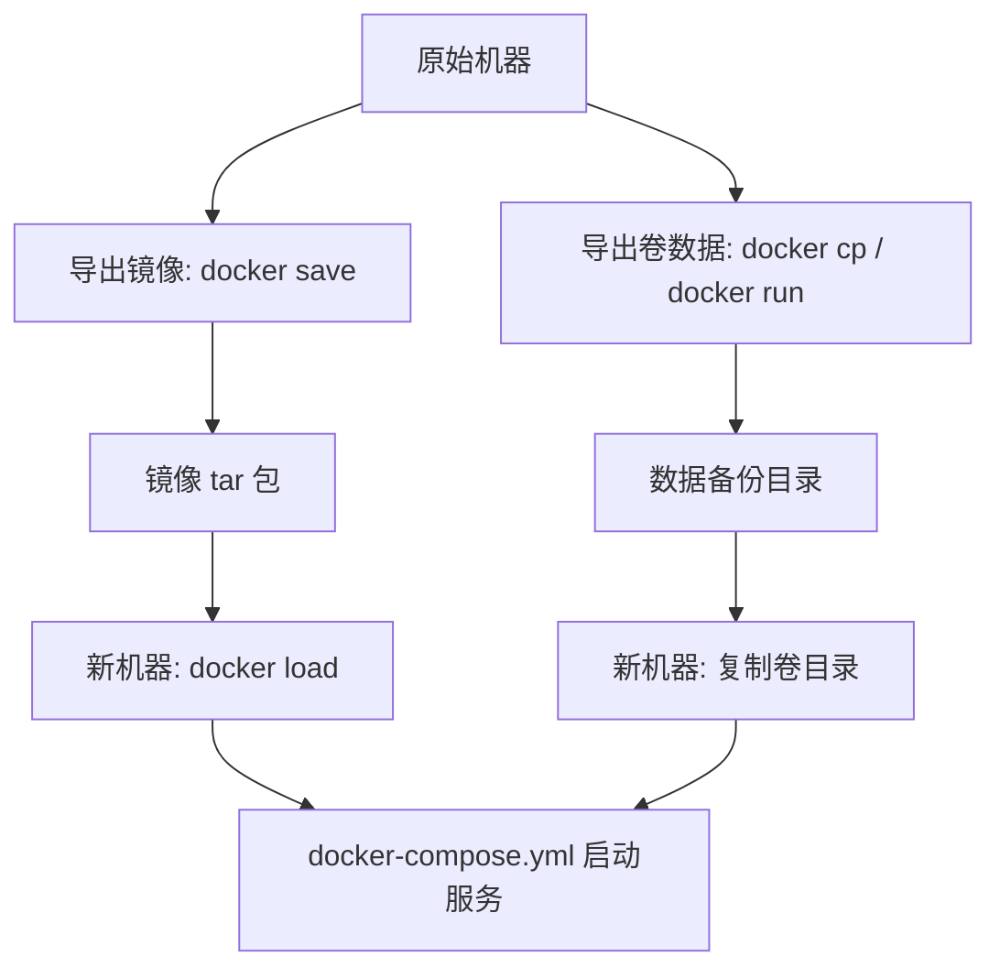
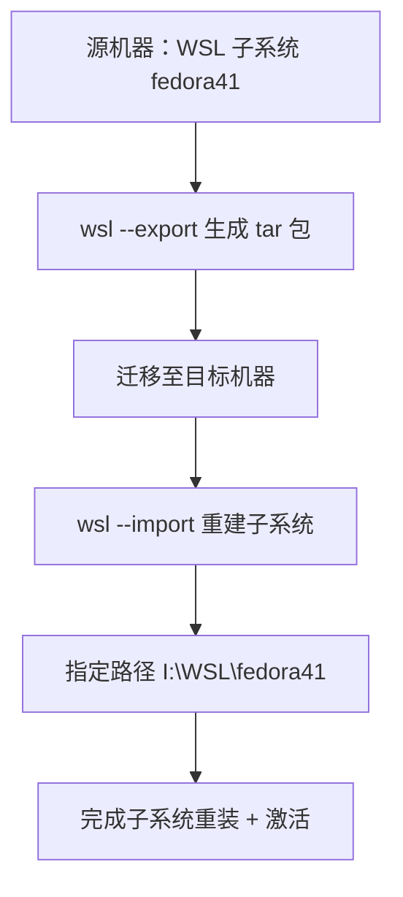
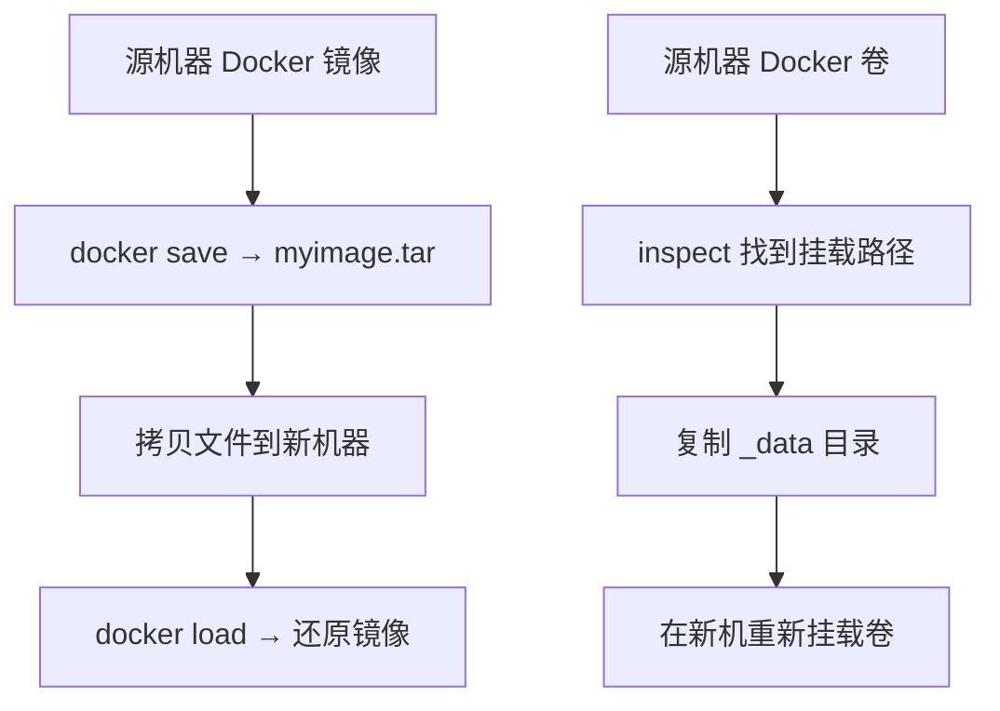
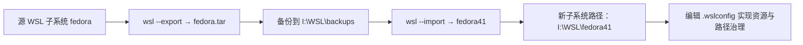
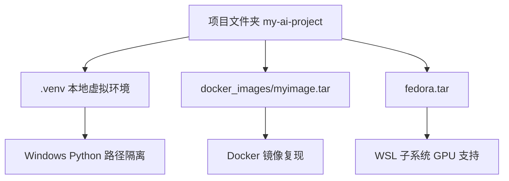
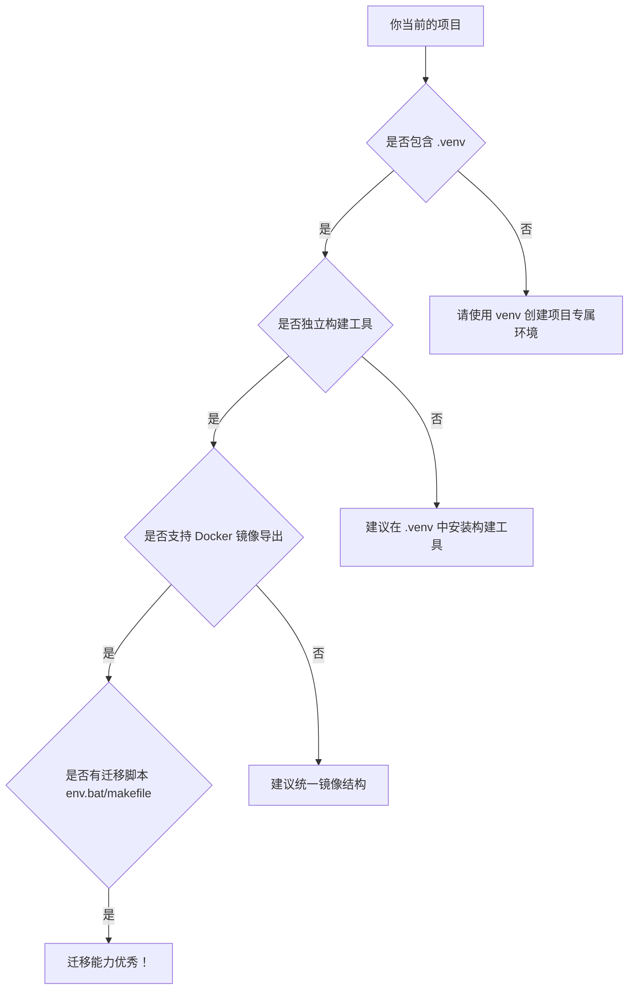

*【理念●体系】迁移复现篇：打造可复制、可复原的 AI 项目开发环境*
https://aicity.blog.csdn.net/article/details/149296906?spm=1011.2415.3001.5331


# 【理念●体系】迁移复现篇：打造可复制、可复原的 AI 项目开发环境

## 一、引言：环境部署≠可迁移，工具打通≠可复现
在上一篇《路径治理篇》中，我们从结构化的视角出发，构建了 AI 工具链的“路径秩序”，让系统、虚拟机、容器、Python 环境各就其位、互不干扰。  

但部署完成 ≠ 环境稳定，打通链路 ≠ 项目可复现。  

真正让人焦虑的，是这些问题：  
- 换一台电脑，项目打不开了；  
- 拷贝了代码，却丢了环境；  
- 安装好 Docker，却运行不了旧镜像；  
- 项目能跑，但部署逻辑全靠记忆……  

这些现象背后，反映的不是技术难题，而是“环境迁移意识的缺失”。如果一个项目的构建、运行、调试全依赖于当前机器的某些“临时状态”，那么它一旦换平台、换路径、换系统，就极可能失效。  

我曾在这篇实践中指出：  
🔗 从路径治理到工具链迁移：一套可控的AI项目迁移规范  

正是因为没有对 `.venv`、Docker、WSL 的迁移路径、状态、配置进行标准化管理，才导致很多项目“只能在作者电脑上跑”。  

所以，我构建了本篇所要分享的迁移与复现治理模型：  
一套让项目可以真正“拷贝就能跑”的方法体系。

## 二、路径一致性：迁移复现的首要前提
在部署一个可以迁移的 AI 项目之前，你必须问自己一个问题：  
“我的工具和项目，路径是否可预测？”  

很多项目无法复现的根源不是技术问题，而是路径依赖混乱：  
- Python 虚拟环境安装在 `C:\Users\xxx\AppData\Roaming\...`；  
- Docker 镜像 默认存储在系统盘隐藏目录；  
- WSL 子系统随机挂载在 `\\wsl.localhost\<>` ；  
- Conda 环境路径被系统自动分配；  
- 项目目录夹杂在桌面、文档、下载文件夹中……  

这就导致：  
- 迁移时找不到依赖；  
- 映射路径失效；  
- 权限错乱，GPU 不可用；  
- 工具执行顺序混乱。  

✅ 解决方案：统一路径根目录，构建“开发磁盘架构”  
我的解决方式是 —— 将所有开发环境组件统一迁移至 I 盘，并规划出一套稳定的路径架构：  
```
I:\
├── Conda\                    ← Anaconda 主目录
│   └── envs\                 ← 所有 Python 版本
├── Docker\
│   ├── images\               ← 容器镜像
│   └── volumes\              ← 数据卷
├── WSL\
│   └── fedora41\             ← 子系统存储目录
├── Projects\
│   └── my-ai-project\        ← 项目根目录
│       └── .venv\            ← 虚拟环境目录
├── Tools\                    ← 构建工具目录（hatch/poetry/uv）
└── Backup\                   ← 导出用的 .tar / 镜像包等
```

每一层目录对应一个独立职责的组件，避免互相侵入。  

我在这篇文章中详细记录了整个路径迁移过程：  
🔗 Docker 镜像卷静默迁移与路径规划  

💡 Mermaid 图：路径架构树形图  
盘  
Conda Docker WSL Projects Tools Backup  
envs images volumes fedora41 my-ai-project  
.venv  



此图结构清晰地展示了各模块存放结构，便于迁移时一目了然。

## 三、虚拟环境迁移：`.venv` 的复制与重建策略
项目是否真正可迁移，有一个重要标志：  
你的项目能不能不联网、不开 Conda、不开系统管理员权限，直接运行？  

答案的关键，就在于：项目内是否包含了自己的 Python 解释器和依赖工具链。  

这正是我们主张项目内建 `.venv` 虚拟环境的原因。  

✅ 为什么不推荐用 Conda 环境共享？  
尽管 Conda 提供了强大的环境管理功能，但它天生有几个“不可迁移”的痛点：  
- 环境目录复杂、冗长、不定长；  
- 路径容易随版本更新而改变；  
- 必须依赖 Conda 自身命令来激活，无法跟随项目；  
- 不方便项目打包和结构复现。  

✅ `.venv` 是更适合迁移的项目环境结构  
项目根目录下的 `.venv` 虚拟环境具备以下优点：  
- 环境与项目结构绑定，路径固定；  
- 可使用系统已有 Python 执行文件构建，免安装；  
- 可以完整打包、压缩、复制、还原；  
- 构建工具（如 poetry、hatch）也可随 `.venv` 内置；  
- 跨设备迁移时只需注意平台和路径一致。  

我在这篇文章中做了完整的案例迁移演示：  
🔗 项目级 .venv 虚拟环境的迁移实录  

🧪 `.venv` 的迁移策略参考  

| 项 | 策略说明 |
|----|----------|
| ✅ 推荐做法 | `.venv` 复制到新路径后，执行 `python -m pip install -U pip setuptools wheel` 进行重建 |
| ⚠️ 平台限制 | Windows → Windows 兼容性较好；Linux → Windows 不建议通用 |
| 💡 路径小技巧 | 新机器可配置同样路径，如 `I:\Projects\my-ai-project\.venv\`，避免路径错位 |
| 🛠️ 自动化建议 | 提供 `env.bat` 或 `make bootstrap.ps1` 实现路径修复与环境重建 |

🧩 示例结构：`.venv` 项目布局  
```
my-ai-project/
├── .venv/                  ← 项目自带虚拟环境
├── pyproject.toml          ← 构建配置
├── poetry.lock             ← 锁定依赖
├── env.bat / env.sh        ← 激活脚本
├── makefile / bootstrap.ps1 ← 一键重建脚本
└── src/
    └── main.py
```

在 `.venv` 中安装构建工具（如 `poetry`）后，整个项目可脱离 Conda 或系统 Python，自主运行。  

📌 Mermaid 图：`.venv` 项目结构图  
my-ai-project  
.venv pyproject.toml poetry.lock env.bat / env.sh makefile / bootstrap.ps1 src/  
main.py  



这张结构图可帮助开发者清晰理解项目目录层级以及 `.venv` 的嵌入位置和迁移意义。

## 四、容器环境迁移：Docker 镜像与数据卷的结构化导出策略
在 AI 开发体系中，Docker 是极其关键的一环。我们通过它来运行服务、部署模型、构建镜像。然而一旦环境要迁移，很多开发者都会踩坑：  
- 镜像太大，不知道怎么搬；  
- 容器运行依赖卷数据，但不知如何提取；  
- 更换电脑后容器跑不起来，配置全丢失。  

其实，Docker 的环境是可以非常结构化地导出、复制、重建的，只要你采用了正确的策略。  

🧱 镜像迁移：用 `docker save/load` 实现打包转移  
镜像是可打包的。Docker 提供了标准方式来导出和导入镜像：  
```bash
# 导出镜像为 tar 包
docker save -o myimage.tar myimage:latest 

# 导入 tar 包到新机器
docker load -i myimage.tar
```

你可以将这个 tar 文件连同项目一并打包，迁移到新设备后再导入，无需重新 build。  

📌 实践参考：  
🔗 Docker 镜像与卷路径静默迁移方案（含符号链接法）  

💾 卷数据迁移：映射、提取与还原  
Docker 容器中经常会使用 volume（卷）来存放持久化数据，比如模型文件、数据库内容、日志缓存等。  

迁移时，你可以这样做：  
```bash
# 查看卷的物理路径
docker volume inspect my_volume 

# 将卷中的内容复制出来
docker run --rm -v my_volume:/data -v %cd%:/backup alpine cp -r /data /backup
```

注意：一定要先找到宿主机上的挂载路径，然后使用容器内的 `cp` 或挂载目录进行备份。  

🧰 容器编排配置的迁移：docker-compose.yml  
建议所有容器都使用 `docker-compose.yml` 进行定义，这样你就能完整迁移容器的运行参数、端口映射、挂载目录、环境变量等。  

```yaml
version: "3"
services:
  myapp:
    image: myimage:latest
    ports:
      - "8080:80"
    volumes:
      - ./data:/app/data
    environment:
      - CUDA_VISIBLE_DEVICES=0
```

📦 将 `docker-compose.yml` 一并复制到新设备后，运行：  
```bash
docker-compose up -d
```

即可快速还原服务运行。  

🚨 注意事项  

| 项目 | 建议做法 |
|------|----------|
| 镜像过大 | 使用压缩 `tar` 打包，必要时分卷 |
| 宿主路径不同 | 使用相对路径、统一结构管理挂载点 |
| 配置丢失 | 配合 `.env` 文件或 compose 模板版本管理 |
| 权限问题 | 卷路径必须确保宿主系统拥有访问权限（尤其是 Windows + WSL 环境） |

📌 Mermaid 图：Docker 迁移流程图  
原始机器  
导出镜像:docker save 导出卷数据: docker cp / docker run  
镜像 tar包 数据备份目录  
新机器:docker load 新机器:复制卷目录  
docker-compose.yml 启动服务  



以上流程结构化地完成了镜像、卷、配置文件的分离与重组，实现真正意义上的 Docker 服务级别的迁移复现。

## 五、WSL 子系统迁移：发行版导出与跨机重建策略
WSL 是本地 AI 开发体系中承接 Linux 工具链、容器引擎、GPU 驱动桥接的核心。它不像普通软件那样可以简单复制安装，但实际上，WSL 提供了非常完整的导入/导出机制，让我们能够把整个子系统“打包迁移”。  

🎯 目标：让 WSL 子系统像“系统快照”一样迁移，包括发行版、环境、文件结构等。  

📦 标准迁移流程：wsl --export / --import  
WSL 官方提供的导入导出指令：  
```bash
# 导出子系统（将整个发行版打包为 tar 文件）
wsl --export <发行版名称> I:\Backup\fedora.tar 

# 导入到新路径（可指定新的挂载路径和子系统名称）
wsl --import fedora41 I:\WSL\fedora41 I:\Backup\fedora.tar --version 2
```

📌 实践链接：  
🔗 WSL 子系统迁移全流程实战：路径控制 + 快照导出  

📁 挂载路径规划：避免默认安装在 C 盘  
很多人遇到的问题是：WSL 安装后体积暴涨，占据 C 盘空间，而且路径难以查找。  

正确做法是：  
- 在迁移前 预设目标路径（如 I:\WSL\fedora41）  
- 使用 `--import` 自定义子系统目录  
- 搭配 `.wslconfig` 文件设定默认挂载路径  

`.wslconfig` 示例：  
```
[wsl2]
memory=8GB
processors=4
swap=0
localhostForwarding=true
nestedVirtualization=true
kernelCommandLine=quiet splash
```

💡 `.wslconfig` 一般存放于 `C:\Users\<用户名>\.wslconfig`  

🔐 权限配置与 GPU 驱动桥接同步迁移  
迁移后 WSL 子系统要能继续使用 GPU 和 Docker，需要同步以下操作：  

| 项目 | 操作 |
|------|------|
| CUDA 驱动 | 确保 Windows 已装 `NVIDIA GPU 驱动 + WSL 兼容组件` |
| WSL 内部支持 | 子系统需安装 `cuda-toolkit` , `nvidia-container-toolkit` |
| 容器识别 GPU | 在 Docker 中启用 GPU，需测试 `nvidia-smi` 输出是否正常 |

🔄 快速复现全流程（从打包到重建）  
```bash
# Step 1：导出子系统
wsl --export fedora41 I:\Backup\fedora41.tar 

# Step 2：复制到目标机器
# 使用 U 盘 / OneDrive / LAN / rsync 等方式传输 

# Step 3：导入并重建子系统
wsl --import fedora41 I:\WSL\fedora41 I:\Backup\fedora41.tar --version 2 

# Step 4：重启系统，确认 WSL 子系统可正常启动
wsl -d fedora41
```

📌 Mermaid 图：WSL 子系统迁移流程图  
源机器:WSL子系统 fedora41  
wsl --export 生成 tar 包  
迁移至目标机器  
wsl --import 重建子系统  
指定路径 I:\WSL\fedora41  
完成子系统重装+激活  



通过这种方式，我们不仅能备份自己的开发环境，还能实现开发环境的跨机共享、快照复用，大大提升本地 AI 工具链的可靠性与可维护性。

## 六、虚拟环境迁移：本地构建工具链与 .venv 的复用方法
Python 项目开发的核心是虚拟环境，而 `.venv` 是最能实现项目级隔离的方式。许多开发者疑惑：`.venv` 可以直接复制到新机器用吗？工具链也能迁移吗？  

答案是肯定的，但前提是：你有结构良好的路径规划 + 构建工具内置机制。  

🎯 目标：将 `.venv` 环境和 Poetry/uv 等工具一并打包，让项目“拷贝即运行”。  

🗂 标准项目结构  
```
my-ai-project/
├── .venv/                   # 本地虚拟环境（隔离）
├── pyproject.toml           # 构建工具定义（poetry/hatch/pipenv）
├── poetry.lock              # 依赖锁定文件
├── env.bat / env.sh         # 环境激活脚本（自动进入 .venv）
├── bootstrap.ps1 / Makefile # 一键初始化脚本
├── README.md
└── src/
    └── main.py
```

📌 实践参考：  
🔗 构建工具随项目迁移：打造可复现的 Python 工程模板  

✅ `.venv` 可以直接复制吗？  
是的，但注意以下规则：  

| 情况 | 是否可行 | 注意事项 |
|------|----------|----------|
| ✅ 同一平台、相同路径 | 可以直接复制 | 激活脚本无须修改 |
| ⚠️ 同平台但路径不同 | 可复制后修复 | 需重新生成或更新解释器路径 |
| ❌ 跨平台（如 Win→Linux） | 不可复用 | 建议重新构建 `.venv` |

🛠️ 构建工具链随项目走  
不要在系统级安装 poetry、uv 等工具，而应：  

进入 `.venv` 后安装构建工具：  
```bash
.venv\Scripts\activate
pip install poetry
poetry install
```

使用 `bootstrap.ps1` 或 `env.bat` 实现一键重建：  
```bat
@echo off
call .venv\Scripts\activate
pip install poetry
poetry install
```

这样即使换了电脑，也能：  
1. 进入 `.venv`  
2. 安装构建工具  
3. 根据 `pyproject.toml` 还原环境  

🔄 快速迁移复现步骤  
```bash
# Step 1：复制项目文件夹（含 .venv）
# 可通过压缩包 / U盘 / Git传输等方式 

# Step 2：激活 .venv
env.bat 

# Step 3：更新工具链
.venv\Scripts\pip install -U pip setuptools
.venv\Scripts\pip install poetry 

# Step 4：还原依赖
poetry install 

# Step 5：运行项目
python src/main.py
```

📌 Mermaid 图：`.venv` 迁移与复现流程  
激活虚拟环境:env.bat 复制项目文件夹(含.venv) 原项目 my-ai-project  
安装构建工具: poetry/uv  
运行项目 python main.py 执行 poetry install  


通过 `.venv` + 本地构建工具 + 项目自带脚本，我们不依赖全局 Python 或 Conda，完全实现了“项目跟着工具走，工具跟着项目走”的理念。这正是实现个人级 DevOps 的关键一步。

## 七、容器的打包与还原：Docker 镜像与数据卷的迁移规范
在构建 AI 应用时，容器技术是我们部署服务、运行模型的关键工具。但 Docker 的镜像和卷默认存储在系统路径下（如 `C:\ProgramData\Docker` ），如果不做治理，迁移会异常复杂。  

🎯 目标：通过结构化管理与命令导出，实现容器的跨机可迁移、可复现、可结构还原。  

🧱 容器路径治理：存储目录前置规划  
镜像与卷目录推荐统一管理路径，如：  
```
I:\
└── Docker\
    ├── images\
    └── volumes\
```

迁移建议：  
利用 PowerShell 创建符号链接，将默认路径指向预设位置：  
```powershell
Stop-Service com.docker.service
Move-Item "C:\ProgramData\Docker" "I:\Docker"
New-Item -ItemType SymbolicLink -Path "C:\ProgramData\Docker" -Target "I:\Docker"
Start-Service com.docker.service
```

📌 实践参考：  
🔗 Docker 镜像与卷静默迁移实践：用符号链接替代路径配置  

🐳 镜像迁移方法：导出为 `.tar`，跨系统还原  

| 操作 | 命令 |
|------|------|
| 导出镜像 | `docker save myimage -o myimage.tar` |
| 传输文件 | 拷贝 `.tar` 到目标机器 |
| 加载镜像 | `docker load -i myimage.tar` |

🔁 示例：  
```bash
docker save pytorch-gpu:latest -o I:\Backup\pytorch-gpu.tar
# 将文件传输到另一台机器
docker load -i pytorch-gpu.tar
```

💾 数据卷的迁移方法  
Docker 卷通常用于存储模型权重、运行时缓存、数据库数据等。  

步骤一：定位卷路径  
```bash
docker volume inspect myvolume
```

输出中 `"Mountpoint"` 字段即为物理路径，如：  
```
"Mountpoint": "/var/lib/docker/volumes/myvolume/_data"
```

步骤二：拷贝内容  
方法一：使用 `docker cp` 将容器内数据复制出来：  
```bash
docker cp mycontainer:/app/data ./backup/
```

方法二：直接拷贝 `Mountpoint` 路径下的所有内容（需管理员权限）：  
```bash
robocopy "I:\Docker\volumes\myvolume\_data" "I:\Backup\volume_data" /E
```

🔁 快速迁移还原流程（镜像 + 卷）  
```bash
# 镜像导出 + 加载
docker save myimage -o myimage.tar
# 传到新机器
docker load -i myimage.tar 

# 卷备份 + 拷贝
docker volume inspect myvolume
# 拷贝 _data 文件夹
```

📌 Mermaid 图：容器迁移流程总览  
源机器 Docker 镜像 源机器 Docker 卷 docker save → myimage.tar inspect找到挂载路径 复制_data 目录  
拷贝文件到新机器 docker load→还原镜像  
在新机重新挂载卷  



通过标准化的导出/导入命令、统一的路径策略，以及符号链接的存储迁移机制，我们可以确保容器化环境的跨平台复现更加可靠与结构清晰。

## 八、跨机复现核心：WSL 子系统的迁移与重构方法
WSL 是本地 AI 环境架构中的核心桥梁：它连接了 Windows 和 Docker，也承载了 GPU 驱动、Linux 工具链、模型测试环境等内容。一旦构建完成，我们应考虑如何将其稳定迁移到其他设备、磁盘或共享给团队成员。  

🎯 目标：使用结构化路径 + 导出导入命令，实现完整子系统的一键备份与复原。  

🧱 目录治理基础：WSL 路径规划  
建议将所有发行版统一放置在固定盘符与目录下：  
```
I:\
└── WSL\
    ├── fedora41\
    ├── ubuntu22\
    └── backups\
```

这样，当你导出或导入子系统时，可以清晰定位并避免与系统盘冲突。  

📌 实践参考：  
🔗 WSL 子系统迁移与路径治理：挂载点规划与 .wslconfig 配置  

🗂️ 子系统迁移操作指令  

1️⃣ 导出 WSL 子系统  
```bash
wsl --export fedora I:\WSL\backups\fedora.tar
```

`fedora` 为当前 WSL 发行版名称（用 `wsl -l -v` 查看）  
可定期导出 `.tar` 文件进行版本快照  

2️⃣ 导入至目标路径  
```bash
wsl --import fedora41 I:\WSL\fedora41 I:\WSL\backups\fedora.tar --version 2
```

这将把 `fedora.tar` 解压并初始化为 `fedora41` 子系统，路径为 `I:\WSL\fedora41`。  

⚙️ .wslconfig 配置建议  
在用户主目录（如 `C:\Users\love` ）创建 `.wslconfig` 文件：  
```
[wsl2]
memory=8GB
processors=4
swap=0
localhostForwarding=true
kernelCommandLine=quiet
```

如果你想自定义虚拟硬盘或强制路径：  
```
[wsl2]
vmImportPath=I:\WSL\
vmExportPath=I:\WSL\backups\
```

💡 高级技巧：重命名发行版  
导入后想更换发行版名称：  
```bash
wsl --unregister fedora
wsl --import fedora41 I:\WSL\fedora41 fedora.tar --version 2
```

或使用第三方工具如 `LxRunOffline` 进行备份、挂载、自定义目录等操作。  

🧪 快速验证迁移是否成功  
```bash
wsl -l -v                     # 查看当前系统
wsl -d fedora41               # 启动子系统
nvidia-smi                    # 测试 GPU 驱动加载情况
ls /mnt/i/Docker/volumes      # 挂载路径验证
```

📌 Mermaid 图：WSL 子系统迁移与复原流程  



通过结构清晰的目录治理 + WSL 官方导出导入命令 + `.wslconfig` 配置策略，你可以轻松完成子系统的备份、重装、迁移与共享。

## 九、项目整体迁移复刻：.venv、Docker、WSL 的三位一体导出还原规范
一套真正可复现的 AI 本地开发环境，离不开对项目结构、环境依赖、运行基础设施的统一导出与复原策略。  

🧱 三大组成部分及其作用  

| 模块 | 作用说明 | 迁移方式 |
|------|----------|----------|
| `.venv/` | Python 项目本地虚拟环境（依赖隔离） | 直接复制或重建 |
| Docker | 容器化运行环境与镜像/数据 | 镜像导出+导入 |
| WSL 子系统 | 宿主 Linux 内核、桥接 Docker/GPU | 官方导出导入 |

我们应将这三部分统筹考虑，以“结构 → 工具链 → 环境镜像”三层标准导出、重建。  

🧩 推荐迁移结构模板  
```
I:\Projects\my-ai-project\
├── .venv\                  # Python 虚拟环境（Windows可复用）
├── pyproject.toml          # 构建定义文件
├── poetry.lock             # 依赖锁定
├── docker-compose.yml      # 容器部署结构（镜像名统一）
├── fedora.tar              # 导出的 WSL 子系统
├── docker_images\
│   └── myimage.tar         # 导出的 Docker 镜像
├── env.bat / env.sh        # 一键激活环境
└── README.md               # 使用说明
```

🧪 `.venv` 的迁移与重建规范  
✅ 同平台（Windows → Windows）时，`.venv` 可直接复制。  
```bash
# 复制后重建核心工具
.venv\Scripts\activate
pip install --upgrade pip setuptools
pip install poetry
poetry install
```

⚠️ 不同平台间不可直接复用（如 Windows → Linux），建议使用 `requirements.txt` 或重新创建。  

📌 参考原文：  
🔗 Python 多版本治理与 .venv 工具链隔离  

🐳 Docker 镜像与数据卷的迁移  
导出：  
```bash
docker save myimage -o docker_images/myimage.tar
```

导入：  
```bash
docker load -i docker_images/myimage.tar
```

组合部署：  
```bash
docker-compose -f docker-compose.yml up
```

📌 建议统一 `docker-compose.yml` 中镜像与卷挂载路径，便于迁移后自动识别。  

📌 参考原文：  
🔗 Docker 数据迁移脚本 + 卷目录静默处理  

🧊 WSL 子系统的迁移  
如上一节所述：  
```bash
# 导出
wsl --export fedora I:\Backup\fedora.tar 

# 导入
wsl --import fedora41 I:\WSL\fedora41 fedora.tar
```

保持 `.wslconfig`、文件挂载路径与原路径一致，迁移可实现完整复现。  

🎯 快速迁移复现流程（适用于他人或新设备）  
```bash
# Step 1：解压项目文件夹（含 .venv、镜像、tar）

# Step 2：导入 WSL 子系统
wsl --import fedora41 I:\WSL\fedora41 fedora.tar 

# Step 3：导入 Docker 镜像
docker load -i docker_images/myimage.tar 

# Step 4：激活 Python 环境
env.bat
.venv\Scripts\pip install poetry
poetry install 

# Step 5：启动容器或调试服务
docker-compose up
python src/main.py
```

📌 Mermaid 图：项目三位一体迁移结构图  
项目文件夹 my-ai-project  
.venv 本地虚拟环境 docker_images /myimage.tar fedora.tar  
Windows Python 路径隔离 Docker 镜像复现 WSL子系统 GPU 支持  



这样，你的整个项目环境就具备了“完整打包 → 跨设备迁移 → 快速还原”能力。

## 十、总结与最佳实践建议：从可运行到可复制的跃迁
当你完成了这一整套环境迁移体系的构建，你就已经从“能在一台机器跑起来”迈向了“能让所有机器都跑起来”的新阶段。  

这是从开发者向 DevOps 思维的质变跃迁。  

✅ 迁移复现的六项核心要点  

| 核心点 | 要点说明 |
|--------|----------|
| ① 路径治理 | 环境路径、镜像路径、项目路径三分离，提前设计统一结构 |
| ② 工具链本地化 | `.venv` 中内建 Poetry / Pipenv / Hatch 等构建工具 |
| ③ 结构标准化 | 所有项目按统一模板结构组织，具备一键重建脚本 |
| ④ 镜像可导出 | Docker 镜像保存为 `.tar` 文件，容器定义使用 `docker-compose.yml` |
| ⑤ 子系统可复刻 | WSL 使用 `wsl --export / import` 操作，不依赖重新部署 |
| ⑥ 跨设备可还原 | 项目整体 zip 包分发，提供 README 和 env.bat 脚本即可快速上手 |

🛠 最佳实践建议  

1. 将环境视作代码（Env-as-Code）  
环境不可手工依赖，应可重建、可导出、可验证。推荐在项目中写入 `makefile` 或 `bootstrap.ps1` 脚本。  

2. 每个项目都有独立 `.venv` 和构建工具版本  
不依赖全局 Python、pip、poetry 等；构建工具和解释器“跟项目走”。  

3. 定期导出 Docker 镜像与 WSL 快照  
不仅便于迁移，还能应对突发故障恢复。  

4. 文档与结构并重  
每个项目应自带完整说明（README.md）、迁移操作流程与路径结构图，降低协作门槛。  

🚀 你的开发环境是否具备这些迁移能力？  
快速自检：  
- `.venv` 是否在项目内？是否可直接复制？  
- 构建工具是否独立？是否已安装 poetry/pipenv/hatch？  
- Docker 镜像是否可导出？是否使用统一命名？  
- 项目结构是否已标准化？  
- 是否有 env.bat/makefile 帮助新环境激活？  
- 是否能在新机器 15 分钟内跑通你的项目？  

如果上述你能打 ✅ 三项以上，说明你已经初步具备了“项目迁移复现”的能力。  

✅ Mermaid 配图：迁移能力自检清单流程图  
你当前的项目  
是否包含.venv  
否  
是否独立构建工具 请使用venv创建项目专属环境  
否  
是否支持 Docker 镜像导出 建议在.venv中安装构建工具  
否  
是否有迁移脚本 env.bat/makefile 建议统一镜像结构  
迁移能力优秀!  


